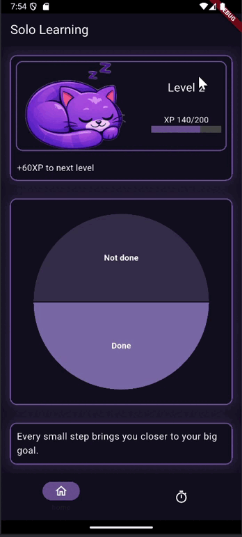
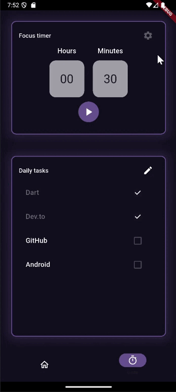

# SoloLearning

SoloLearning is a gamified productivity app designed to help users stay focused, manage daily tasks, and track their learning progress through an RPG-inspired leveling system.

*This project was originally created as a weekend MVP for the DEV Challenge and has been refactored, cleaned up, and polished for the **GitHub Finish-Up-A-Thon Challenge**.*

---
<table>
<tr>
<td>

</td>
<td>

</td>
</tr>
</table>

## 🚀 Current Features

* **RPG-Inspired Progress System:** Track your level, current XP, and the remaining points needed for the next upgrade on a dedicated screen (carried over and polished from the initial MVP).
* **Interactive Task Analytics:** A real-time pie chart built with the `fl_chart` package that dynamically calculates and displays the ratio of completed versus remaining tasks.
* **3D Time Selector:** A focus timer setup featuring scrollable 3D hour and minute wheels built using `ListWheelScrollView`.
* **Forced Landscape View:** When starting the timer, the app automatically switches to landscape orientation so users can place their phone horizontally beside their laptop while studying or coding.
* **Memory-Optimized Daily Tasks:** A clean task list utilizing `ListView.builder` to prevent memory overflows. Includes native swipe-to-delete (`Dismissible`) gestures.
* **Anti-Abuse Checkboxes:** Once a task is completed, its text is struck out, the main chart updates, and the checkbox becomes disabled so users cannot repeatedly toggle it to farm XP.
* **Stream-Driven Motivation:** A standalone reactive widget powered by Dart `Stream.periodic` that automatically changes motivational quotes every few minutes without full-screen rebuilds.

---

## Tech Stack & Architecture

* **Framework:** Flutter (Dart)
* **State Management:** Provider
* **Architecture:** Feature-first architecture for a clean and professional project structure.
* **UI & Graphics:** `fl_chart` for data visualization.

---

## Roadmap & Future Enhancements

* [ ] **State Persistence:** Integrate `SharedPreferences` to save tasks, user level/XP, and chart progress between app launches.
* [ ] **Automated Daily Resets:** Implement local date-based logic to automatically reset completed tasks to "not done" every 24 hours.
* [ ] **Responsive UI Layouts:** Master Flutter adaptive design using `LayoutBuilder` and media queries to ensure the interface looks perfect on all screen sizes.
* [ ] **Audio Feedback:** Add audio plugins to play notification sounds when the timer finishes.